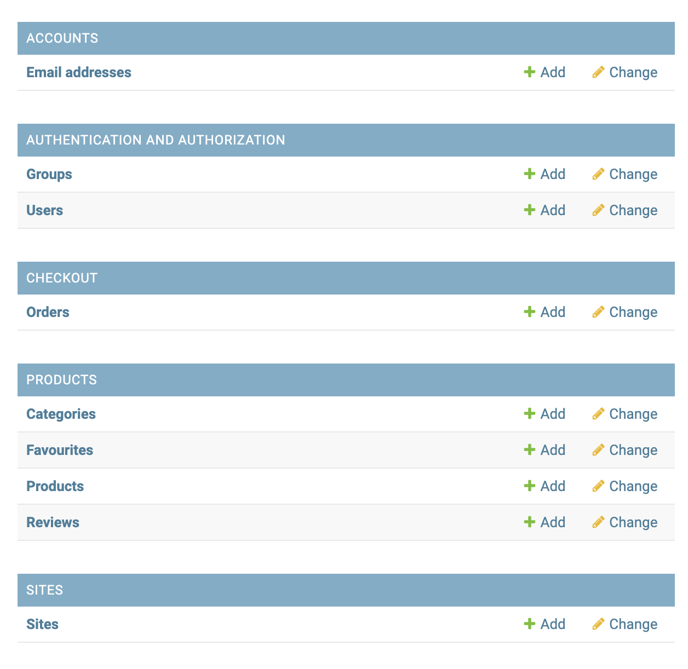

# Sweets 'N' Treats
> ## Online Sweet and Treat Shop

[View the website here](https://sweetsntreats.herokuapp.com/)

## Author Note

With more time I would like to tidy up the html pages so that they are more modular. I would also work on the colours of the website and some of the css using classes to target differing elements.

I also wanted to add a 'gift message' which would allow a user to send a message to the person they were buying for.

## About

This is my MS4 Milstone Project website created as part of a Full Stack Software Development in Code Institute by [Michael Greenberry](https://www.linkedin.com/in/michael-greenberry-637299108/).

This website was designed to all users to purchase pic 'n' mix and other sweets. Users can log in and leave reviews and/or make an item a favourite

This site was built for educational reasons therefore images are mainly from google search. No payment is taken and no deliveries will be fulfilled. 

The site is designed to be responsive and easy to navigate on a range of devices to make it easily accessible for all users. 

**Note for Assessors**

If you would like to use Stripe to create a purchase, please use the following test card details:

* Card Number - 4242 4242 4242 4242
* MM/YY - 0424
* CVC - 242

If using the Developer Server please use the following details for superuser login: -

  * michaelg
  * BS2208df

Or create a user from 'My Account'

If using the Heroku Server then please use the following details for superuser login: -

  * michaelgreenberry
  * BS2208df

Or create a user from 'My Account'

## Table of contents
1. [UX - User Experience](#ux-user-experience)
   * [User Stories](#user-stories)
   * [Design Choices](#design-choices)
     1. [Typography](#typography)
     2. [Colours](#colours)
     3. [Imagery](#imagery)
     4. [Icons](#icons)
     5. [Layout](#layout)
   * [Structure](#structure)
   * [Wireframes](#wireframes)
2. [Site Navigation](#site-navigation)
3. [Features](#features)
   * [All Pages](#all-pages)
   * [All Products](#all-products)
   * [Individual Product](#individual-product)
   * [Basket](#basket)
   * [Checkout](#checkout)
   * [Error Pages](#error-pages)
   * FOR LOGGED IN USER & SUPERUSER
   * [Profile Page](#profile-page)
   * [Reviewed Item](#reviewed-item)
   * [Favourite](#favourite)
   * FOR LOGGED IN SUPERUSER
   * [Add a product](#add-a-product)
   * [Edit a product](#edit-a-product)
   * [Delete a product](#delete-a-product)
   * [Future Features](#future-features)
   * [Defensive Design](#defensive-design)
4. [Database](#database)
   * [Database Design](#database-design)
   * [Users](#users)
   * [Products](#products)
   * [Categories](#categories)
   * [Reviews](#reviews)
   * [Favourite Item](#favourite-item)
   * [Orders](#orders)
5. [Technologies Used](#technologies-used)
   * [Languages](#languages)
   * [Framework Library](#framework-library)
   * [Tools](#tools)
   * [Testing Tools](#testing-tools)
6. [Testing](#testing)
7. [Bugs](docs/readme/bugs.pdf)
8. [Version Control](#version-control)
9. [Deployment](#deployment)
   * [Project creation](#project-creation)
   * [Heroku](#heroku)
      * [Amazon](#amazon-aws)
      * [GMail Client](#gmail-client)
      * [Convig Vars](#config-vars)
   * [Forking](#forking)
   * [Cloning and Implementing Locally](#cloning-and-implementing-locally)
10. [Code](#code)
      * [HTML](#html)
      * [CSS](#css)
      * [Javascript/JQuery](#javascriptjquery)
      * [Python](#python)
11. [Credits](#credits)
   * [Content](#content)
   * [Media](#media)
   * [Icons](#icons)
   * [Acknowledgements](#acknowledgements)
12. [Author Information](#author-information)

## UX (User Experience)
### User Stories

A list of the user stories and goals can be found [here](docs/readme/user-story.pdf)

## **Design Choices**

### **Typography**

The fonts were chosen to complement one another and also give the aesthetic of a fun, sweet store with ['Akshar']() and ['Open Sans']() as a contrasting font to help the cursive stand out 

### **Colours**

- A pastel blue was employed for the header and a pastel peach/pink for the overlay on each site.
- These colours would be changed for better contrast and to give better scores on lighthouse and for better assessability
- A suitable palette would be sourced from [Coolors](https://coolors.co/) and will be implemented if time.

### **Imagery**

**Please note that the images used in the website were sourced from a Google search with the intention of replacing them from free sites such as pexels.com. However, individual sweet images were not found in pexels.com and due to time constraints I have now come to the point I need to submit the project and I was unable to find the source of the images included on the site. Obviously, I will aim to amend the images before submission if possible**

At present all images used in this site are from [Browns Sweets](https://browns-sweets.com/)

### **Icons**

The icons were sourced from [Font Awesome](https://fontawesome.com/). The Favicom icon was created using [Favicon io](https://favicon.io/)

### **Layout**


## **Structure**
The database. This allows the following functionality: -
* Registration
* Login/Logout
* Add product items to store
* CRUD:-
  * Create: Create a new user. Create a new product item if superuser logged in. Create a review if user logged in. Create a 'favourite' linked item.
  * Read: Collects information held within the database
  * Update: Allows editing of items in database, such as a product or review
  * Delete: Allows deleting of items in database, such as products, reviews or favourites

## **Wireframes**

The wireframes were created using [Balsamiq](https://balsamiq.com) and can be found in pdf form. 

[Mobile Wireframe](docs/readme/ms4-mobile.pdf)
Tablet view would be very similar to mobile view and time didn't allow another wireframe creation.

[Desktop Wireframe](docs/readme/ms4-desktop.pdf)

[Back to content](#table-of-contents)

## **Site Navigation**

The navigation bar displays different links depending on whether the user is logged in, logged out or a super user.

| Link | Not logged in  | Logged in | Logged in as super user |
|---------------|---------------|---------------|-------------|
| Home | &#10003;| &#10003; | &#10003; |
| Log In  | &#10003;  | &#10007;  | &#10007;  |
| Register | &#10003;  | &#10007;  | &#10007;  |
| Profile  | &#10007;  | &#10003;  | &#10003;  |
| Log Out  | &#10007;  | &#10003;  | &#10003;  |
| Search  | &#10003;  | &#10003;  | &#10003;  |
| Leave a Review  | &#10007;   | &#10003;  | &#10003;  |
| Edit Review | &#10007;  | &#10003; | &#10003; |
| Delete Review | &#10007;  | &#10003; | &#10003; |
| Add Product | &#10007; | &#10007;  |  &#10003; |
| Edit Product | &#10007;  | &#10007; | &#10003; |
| Favourite | &#10007; | &#10003; | &#10003; |
| Not Favourite| &#10007; | &#10003; | &#10003; |


[Back to content](#table-of-contents)
## Features
### **All Pages**
Every page contains the following features at the top of the website as standard: -
* Text as a header reading "Sweets 'N' Treats" which also acts as a clickable event to take to the home page
* A responsive navigation bar, which reduces into a 'hamburger' navigation bar on mobiles. Allows all users to click on the page they want and access said page easily. Each navigation bar has the following links: -
  1. Home Page - Displays a teaser message and button to allow shopping
  2. All Products - Allows users to sort the products they wish by name, category, etc (ON MOBILE - this will be hidden by a hamburger menu option)
  3. Pic N Mix - Allows users to find objects under certain tags. i.e. fizzy sweets or traditional (ON MOBILE - this will be hidden by a hamburger menu option)
  4. Search bar - Allows users to search for specific items or for certain types of sweets for direct location
  5. Login/Signup - Allows user to create an account or log into an account

  ```**IF USER LOGGED IN**```

    logout

  ```**IF SUPERUSER LOGGED IN**```

    Product Management - Add a product to the store as required

  7. Shopping Basket - Allows users to see products added to their shopping basket

<br></br>
  Every page contains the following features in the footer: -
* Site header and strapline - TO IMPLEMENT
* Contact details (fake) - TO IMPLEMENT

#### **All Products**
  1. All Products - displays all items currently available in the shop. Clicking on an item will open up the individual product detail page.

  ```**IF USER LOGGED IN!**```

    2. Add an item as a favourite
    3. Remove an item as a favourite

#### Individual Product
  1. Add to Basket - Allows user to add product to basket
  2. Keep Shopping - Takes user back to the All Products page to choose more products
  3. My Basket - Allows users to see what products they currently have and to checkout if required

  ```**IF USER AND/OR SUPERUSER LOGGED IN!**```

    1. Add a Review - Allows a user who has logged in to create a review on selected item
    2. Edit a Review - Allows the user who created a review to edit if required
    3. Delete a Review - Allows the user who created the review to delete if required

  ```**IF USER IS A SUPERUSER!!**```

    1. Edit a Product - Allows a superuser to edit an existing product
    2. Delete a Product - Allows a superuser to delete an existing product

#### Basket
  1. Displays a list of items a user has added to their basket
  2. Checkout button allows user to proceed to checkout
  3. Back to shopping button allows user to add more items to their basket

#### Checkout
  1. Allows users to complete a purchase of products added to their basket
  2. Checkout button submits the purchase
  3. Back to shopping button allows user to add more items to their basket

  LOGGED IN USERS

  4. Store checkout information to profile

#### Error Pages
* These pages are not linked to any other page in the website
* These pages are only accessed if the user encounters an error within the navigation process
* The error page displays a message to the user to notify them of the error
* There is 1 call-out button in this section. This allows the user to return to the home page of the main website - [Home Page]()

### **Error Pages**
#### *404.html*
 - 404 page created to redirect users back to the main site in case of an error - UNTESTED AT PRESENT

#### *403.html*
 - 403 page created to redirect users back to the main site in case they try to access a page they are not authorised to - NOT TESTED AT PRESENT

#### *500.html*
 - 500 error page created to redirect users to the main site after a server error - UNTESTED


FOR LOGGED ON USER OR SUPERUSER
#### Profile Page
  1. Contact detail information 
  2. Previous orders made by user
  3. Button to update information if required

#### Reviewed Item
- Allows a logged in user to create a review
- Allows a logged in user to edit reviews they have created
- Allows a logged in user to delete a review they have created

#### Favourite
- Allows a logged in user to mark an item as a favourite
- Allows a logged in user to unmark an item as a favourite


FOR LOGGED IN SUPERUSER
#### Add a Product
- Allows a superusre to add a product to the store

#### Edit a Product
- Allows a superuser to edit a product in the store

#### Delete a Product
- Allows a superuser to delete a product from the store

### **Future Features**
- I would like to implement a feature where if users log out of the site with items in their basket the items would be there upon log in again. Currently this is not the case.
- The ability to add many filters to their search criteria
- The ability for users to change their username.
- A gift message feature for users to add a message if buying items as a gift
[Back to content](#table-of-contents)

### **Defensive Design**
- **Form Validation**
  - Form validation has been added to every form to ensure all required information is included before submitting.
  - If incorrect data is input a warning text appears to advise the user how to continue

- **Default Image if none added**
  - In the event that a product is added without an image a default image will be added however this is unlikely due to form validation.
- **Unauthorised Attempts**
  - An [error](static/docs/images/error.png) is launched if the user attempts to visit a part of the site where they are not authorised 
- **@login_required**
  - @login_required decorator added to restrict access to certain pages.
      - If a logged-out user tries to access a restricted page, they will be redirected to the login page.
      - Only authorised users may perform certain actions: Eg add, edit, delete product and edit, delete review posts.
- **Basket**
  - Validation ensures a minimum of 0 product and maximum of 99 products is added to the basket.
  - Error message appears if user tries to add negative numbers of items "Value must be greater than or equal to 0"

[Back to content](#table-of-contents)

## **Database**
- db.sqlite3
    - Cloud based database to hold the product, user, order fields, etc.

### **Database Design**
The Database design was based on the following 

The sqlite database holds the following information: -

### Users
Key      | Value
---------|-----------
| _id      | ObjectId |
| username | String |
| email address | String |
| first name | String |
| last name | String |
| staff status | Boolean |

### Products
Key             | Value
----------------|-----------
_id             | ObjectId
sku      | String
name       | String
category         | String
price  | String
image    | String
is_favourite     | Boolean

### Categories
Key      | Value
---------|-----------
_id      | ObjectId
friendly name| String
name | String

### Reviews
Key      | Value
---------|-----------
_id      | ObjectId
review title | String
review body | String
author   | String
product  | String

### Favourite Item
Key      | Value
---------|-----------
_id      | ObjectId
user profile | String
product  | String

### Orders
Key      | Value
---------|-----------
_id      | ObjectId
order number | String
date  | String
full name | String
order total  | String
delivery cost  | String
grand total  | String

The User, Product, Review and Favourite sections all have unique ID's which link them to each other

[Back to content](#table-of-contents)

## **Technologies Used**
### **Languages**
- [HTML5](https://developer.mozilla.org/en-US/docs/Web/HTML)
  - Used as the main markup language for the website content.
- [CSS3](https://developer.mozilla.org/en-US/docs/Web/CSS)
  - Used to style the individual webpages.
- [JavaScript](https://developer.mozilla.org/en-US/docs/Web/JavaScript)
    - Used to show the questions through pagination and for the game play.
- [Python 3](https://www.python.org/)
    - Used to run the site and database

### **Framework Library**
- [Django](https://www.djangoproject.com/)
    - High level framework used for rapid development of the site. 

### **Tools**
- [Git](https://git-scm.com/)
  - Git was used for version control (commit to Git and push to GitHub).
- [GitHub](https://github.com/)
  - Used to store, host and deploy the project files and source code after being pushed from Git. I also used it for the Project Kanban board to keep track and split tasks into smaller tasks to make them easier to fulfill.
- [Gitpod](https://www.gitpod.io/)
  - An online IDE linked to the GitHub repository used to write my code.
- [Heroku](https://www.heroku.com/home)
    - A Cloud Application Platform used to deploy the site
- [AWS](https://aws.amazon.com/)
    - A cloud application to hold media files.
- [Google fonts](https://fonts.google.com/)
  - Used to compare and choose fonts. 
- [Favicons](https://favicon.io/)
  - Used to generate a favicon for the website title.
- [Lighthouse](https://developers.google.com/web/tools/lighthouse)
  - Used to audit the site for quality and ensure responsiveness.
- [Am I Responsive](http://ami.responsivedesign.is/)
  - An online tool to check how responsive the site is on different devices and displayed at the top of the README file. 
- [PEP8 Online](http://pep8online.com/)
    - Used to check PEP8 compliance in the code
- [W3C Markup Validator](https://validator.w3.org/)
    - Markup validation service for HTML5
- [Jigsaw Validator](https://jigsaw.w3.org/css-validator/)
    - CSS3 Validation Service

[Back to content](#table-of-contents)

### Testing Tools
* [hmtl validation](https://validator.w3.org) to check the html code had no errors
* [css validation](https://jigsaw.w3.org/css-validator/) to check the css code had no errors
* [JAVASCRIPT](https://jshint.com/) to check for warnings/errors
* [pep8 Online](http://pep8online.com/) to test Python code
* [Lighthouse](https://chrome.google.com/webstore/detail/lighthouse/blipmdconlkpinefehnmjammfjpmpbjk?hl=en) an online validation tool that helps to improve performance and quality of the webpage with helpful tips to improve as each html page is scored.

[Back to content](#table-of-contents)
## Testing
Testing information can be found [here](TESTING.md)

## **Bugs**
Please find a list of bugs [here](docs/readme/bugs.pdf)

## **Version Control**
**Version control** was managed within **GitHub** and **Gitpod** and regular commits pushed to **GitHub**. 
See below for how this was managed:

### Gitpod Workspaces
1. Starting from GitHub clone the [Code Institute template](https://github.com/Code-Institute-Org/gitpod-full-template) by clicking Use This Template and copying to my repository under the name ms1-ali-shiatsu. The workspace is then launched by clicking GitPod - this action only needs to be performed once and then workspace reopened from GitPod.
2. Start the Gitpod Workspace which opens an **online IDE editor** window.


[Back to content](#table-of-contents)

## **Deployment**
### Project creation
* The website project was created by going to [Github](https://github.com/), a code hosting platform, using the following steps: -
  1. Create an account using an email address and password or a google account
  2. Log in to account and create a new repository!
  3. Give this new repository a creative name. Then click the green Gitpod button which will take you to [Gitpod](https://gitpod.io/workspaces). Gitpod is an open source platform for code development
  4. Then open this platform and start coding
  5. To save the work I had to do the following: - Click 'File', click 'auto save'
  6. To save the work to github I needed to do the following: -
    * git add (either the name of the file, i.e. home.html or '-A', or '.' which adds everything that has been worked on that day)
    * git commit (either the name of the file, i.e. index.html or '-m' and then add a comment in parenthesis "" and enter)
    * It is recommended to commit daily. To complete the necessary steps to upload to github I needed to use the command - git push. This then 'pushed' all the saved work back to Github

[Back to content](#table-of-contents)

### Heroku
This project was developed using [GitPod](https://gitpod.io) and pushed to [GitHub](https://github.com/) then was deployed using [Heroku](https://www.heroku.com/) using the following steps below:

#### Connecting to Heroku
1. Log in to Heroku and create a new app by clicking `New` and `Create New App` and giving it an original name and setting the region to closest to your location.
2. Navigate to `Heroku Resources` and add `Postgres` using the free plan.
3. Create a `requirements.txt` file using the command `pip3 freeze --local > requirements.txt` in the GitPod terminal.
4. Create a `Procfile` with the terminal command `web: gunicorn sweetsntreats.wsgi:application` and at this point checking the Procfile to make sure there is no extra blank line as this can cause issues when deploying to Heroku.
5. Use the loaddata command to load the fixtures for both json files: `python3 manage.py loaddata categories` and `python3 manage.py loaddata products`.
6. If it returns error message: `django.db.utils.OperationalError: FATAL: role <somerandomletters> does not exist` run `unset PGHOSTADDR` in your terminal and run the commands in step 11 again.
7. From the CLI log in to Heroku using command `heroku login -i`.
8. Temporarily disable Collectstatic by running: `heroku:config:set DISABLE_COLLECTSTATIC=1 --app <heroku-app-name>` So that Heroku won't try to collect static files when we deploy.
9. Add Heroku app name to `ALLOWED_HOSTS` in settings.py.
10. Commit changes to GitHub using `git add .`, `git commit -m <commit message>`, `git push`.
11. Then deploy to Heroku using `git push heroku main`.
12. If the git remote isn't initialised you may have to do that first by running `heroku git:remote -a <heroku-app-name>`
13. Create a superuser using command: `heroku run python3 manage.py createsuperuser` so that you can log in to admin as required.
14. From the Heroku dashboard click `Deploy` -> `Deployment Method` and select `GitHub`.
15. Search for your GitHub repo and connect then Enable Automatic Deploys.
16. Generate secret key. Strong secret keys can be obtained from [MiniWebTool](https://miniwebtool.com/django-secret-key-generator/). This automatically generates a secret key 50 characters long with alphanumeric characters and symbols. 
17. Add secret key to GitPod variables and Heroku config vars.
18. Set up Amazon AWS S3 bucket using instructions [below](#amazon-aws)
19. In the dashboard click `Settings` -> `Reveal Config Vars`
20. Set [config vars](#config-vars) using advice below.

#### Amazon AWS
1. Create Amazon AWS account and create a new bucket in the S3 services and choose your closest region.
2. Uncheck block all public access and create bucket. 
3. From Properties tab turn on static website hosting using default values of index.html and errors.html.
4. On permissions tab include CORS configuration:
```python
[
  {
      "AllowedHeaders": [
          "Authorization"
      ],
      "AllowedMethods": [
          "GET"
      ],
      "AllowedOrigins": [
          "*"
      ],
      "ExposeHeaders": []
  }
]
```
5. Create security policy: S3 Bucket Policy, allow all principles by adding a `*` and Amazon S3 services and selecting Get Object action. Paste ARN from Bucket Policy, add statement, generate policy and copy and paste into Bucket Policy. Also add `/*` at end of resource key to allow use of all pages. 
6. Under public access select access to all List Objects. 
7. Create Group for the bucket through IAM. Create policy by importing AWS S3 Full Access policy and add ARN from bucket to the policy resources. Attach policy to group. 
8. Create user, give programmatic access and add user to the group. Download CSV file when prompted to save access key ID an secret access key to save to environment and config variables
9. Add AWS_STORAGE_BUCKET_NAME, AWS_S3_REGION_NAME = 'eu-west-2' to settings.py.
10. Add, commit and push to GitHub then navigate to Heroku to confirm static files collected successfully on the Build Log. The `DISABLE_COLLECTSTATIC` variable can now be deleted.

#### GMail Client
In `settings.py` change the `DEFAULT_FROM_EMAIL` to your own email address.

1. Go to your Gmail account and navigate to the `Settings` tab.
2. Go to `Accounts and Imports`, `Other Google Account Settings`.
3. Go to the `Security` tab, and scroll down to `Signing in to Google`.
4. If required, click to turn on `2-step Verification`, then `Get Started`, and enter your password.
5. Verify using your preferred method, and turn on 2-step verification.
6. Go back to `Security`, `Signing in to Google`, then go to `App Passwords`.
7. Enter your password again if prompted, then set `App` to `Mail`, `Device` to `Other`, and type in `Django`.
8. Copy and paste the passcode that shows up, this is your `EMAIL_HOST_PASS` variable to add to your environment/config variables. `EMAIL_HOST_USER` is the Gmail email address.

### Config Vars
The config/environment variables should be set up as follows:

| Key                    | Value                      |
| ---------------------- |--------------------------- |
| PORT                   | 8000                       |
| IP                     | 0.0.0.0                    |
| SECRET_KEY             | YOUR_SECRET_KEY            |
| STRIPE_PUBLIC_KEY      | STRIPE_PUBLIC_KEY          |
| STRIPE_SECRET_KEY      | YOUR_STRIPE_SECRET_KEY     |
| STRIPE_WH_SECRET       | STRIPE_WEBHOOKS_KEY        |
| DATABASE_URL           | YOUR_POSTGRES_URL          |
| AWS_ACCESS_KEY_ID      | YOUR_AWS_ACCESS_KEY_ID     |
| AWS_SECRET_ACCESS_KEY  | YOUR_AWS_SECRET_ACCESS_KEY |   
| USE_AWS                | True                       |
| EMAIL_HOST_PASS        | YOUR_EMAIL_HOST_PASSCODE   |
| EMAIL_HOST_USER        | YOUR_EMAIL_HOST_USERNAME   |

#### Where to find Config Var Key-value Pairs 
To find the values of each key:

* `SECRET_KEY:` This is a random string provided when creating the Django project and can easily be changed to ensure extra security. 
* `DATABASE_URL:` This is temporary.
* `STRIPE_PUBLIC_KEY:` Retrieved from Stripe Dashboard in the Developer's API section (Publishable key).
* `STRIPE_SECRET_KEY:` Retrieved from Stripe Dashboard in the Developer's API section (Secret key)
* `STRIPE_WH_SECRET:` Retrieved from Stripe Dashboard in the Developer's after creating an endpoint for your webhook (Signing secret).
* `EMAIL_HOST_USER:` Your email address or username.
* `EMAIL_HOST_PASS:` Your passcode from your email client.
* `AWS_SECRET_ACCESS_KEY`: From the CSV file that you download having created a User in Amazon AWS S3.
* `AWS_ACCESS_KEY_ID:` From the CSV file that you download having created a User in Amazon AWS S3.

[Back to content](#table-of-contents)

### Forking  
* If you wish to use this repository as a starting point for your own design, or to contribute to this project, you can fork it. Follow the steps below.
  1. Navigate to the repository in [github](https://github.com/). 
  2. Choose the correct repository. In this case it is [waste not want not](https://github.com/mgreenberry/Waste-Not-Want-Not)
  2. Click 'Fork' in the top-right corner.
  4. This will then create a copy (make sure you have already created your own github account) in your repository
  5. Now follow the steps outlined in [project creation](#project-creation) 
  6. Click 'Pull Requests' and seclect 'New Pull Request' button

### Cloning and Implementing Locally
* To clone the website please use the following steps: -
  1. Navigate to the repository in [github](https://github.com/). 
  2. Choose the correct repository. In this case it is [](https://github.com/mgreenberry/Waste-Not-Want-Not)
  3. Click the 'Code' button
  4. You will now be given options to make a clone of the website, to download it or to open with GitHub Desktop. You can choose to clone the 'HTTPS', the 'SSH' or 'GitHub CLI'
  5. Open Git Bash or similar
  6. Navigate to your desired directory for the cloned project.
  7. Type 'git clone' followed by the URL copied in step 3.
  8. Press 'Enter' to create your local clone.

[Back to content](#table-of-contents)

### **Code**
- A large portion of the Django, Python and JavaScript code was developed following the Code Institute's Boutique Ado walkthrough. 
- CodeInstitute Full Stack Developer Course
- Other students and tutors via Slack and Tutor Support from Code Institute.

#### HTML
HTML pages adapted from the Boutique Ado from Code Institute with additonal coding by myself (user). 
* index.html - adapted from boutique ado
* login/register.html - adapted from boutique ado
* profile.html - adapted from boutique ado
* products.html - mainly user created, adapted from boutique ado
* product-detail.html - mainly user created, adapted from boutique ado
* shopping-basket.html - adapted from boutique ado
* checkout.html - adapted from boutique ado
* add-product.html - adapted from boutique ado
* edit-product.html - adapted from boutique ado
* delete-product - no html page - adapted from boutique ado
* add-review - no html page - created by user
* edit-review.html - created by user
* delete-review - no html apge - created by user
* add-favourite - no html page - created by user
* delete-favourite - no html page - created user

#### CSS
CSS code was written by the creator Michael Greenberry unless stated within the css file

#### JavaScript/JQuery
JQuery code was taken from bootstrap or Boutique Ado project apart unless stated

#### Python
Python, Flask and Jinga code adapted from the Boutique Ado project with extra code written by Michael Greenberry
See TESTING.md and Bugs document for other code adopted and/or provided as options by tutor support.

[Back to content](#table-of-contents)

## Credits
Coding is credited where necessary within code. Most of the python code was amended from the Boutique Ado project from Code Institute with additional help from tutors and fellow students.

### **Content**
Apart from images and some styling, all content is created by the user.

### **Media**
All images are from [Browns Sweets](https://browns-sweets.com/). The aim is to change these images for free stock images before submission if possible.
  
### **Acknowledgements**
- Slack students and study group on Slack

## Author information
Michael Greenberry is the creator and owner of this website. This is a MS4 Milstone Project website created as part of a Full Stack Software Development in Code Institute by [Michael Greenberry](https://www.linkedin.com/in/michael-greenberry-637299108/).

[Back to content](#table-of-contents)