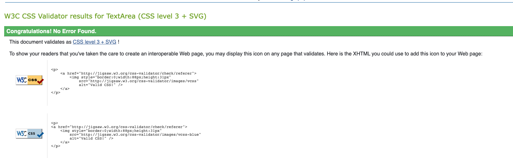

# Sweets 'N' Treats - Testing document

[README.md file](/README.md)

## Table of contents

1. [Validation Testing](#validation-testing)
2. [Lighthouse Testing](#lighthouse-testing)
   * [Mobile Phone](#mobile-phone)
   * [Desktop](#desktop)
3. [Manual Testing](#manual-testing)
   * [All Pages](#all-pages)
   * [Forms](#forms)
4. [User Story Testing](#user-story-testing)
5. [Bugs](#bugs)

## Validation Testing

* [html testing with W3C Markup Validation Service](https://validator.w3.org/)
All errors and warnings listed

* [index](docs/testing/html-validation/index.png)
  * removed 'type=text/javascript' from script tags
* [product](docs/testing/html-validation/products.png)
  * removed strag </i> tag from html code where it appeared
  * removed 'type=text/javascript' from script tags
* [product detail](docs/testing/html-validation/product-detail.png)
  * removed strag </div> tag which was before the 'endif' statement and should have been after
  * removed 'type=text/javascrpt' from script tags
* [basket](docs/testing/html-validation/basket.png)
  * removed 'type=text/javascript' from script tags
* [checkout](docs/testing/html-validation/checkout.png)
  * removed 'type=text/javascript' from script tags
* [add-product](docs/testing/html-validation/add-product.png)
  * removed 'type=text/javascript' from script tags
* [edit-product](docs/testing/html-validation/edit-product.png)
  * removed 'type=text/javascript' from script tags
* [edit-review](docs/testing/html-validation/edit-review.png)
  * removed 'type=text/javascript' from script tags

* [css testing using W3C CSS Validation Service](https://jigsaw.w3.org/css-validator/)
All CSS code was put through the W3C Validation Service. The following message was shown: -


* [JsQuery testing using jshint.com](https://jshint.com/).
  At the time of writing this Testing document I have not had chance to check the jquery/javascript through jshint.

* [Pep8 Testing](http://pep8online.com/)
pep8 tests were done on all html and py files. All html pages had similar warnings about whitespace and identation. Where possible this was changed to remove warning. However, removing some warnings by adding/deleting whitespace or changing identation broke the code and some code wouldn't work as expected. This was especially true of the following example - £{{ item.product.price | calc_subtotal:item.quantity }}

On the settings.py in the sweetsntreats folder the only errors were lines too lone. I was unable to change this and still get the page to site to work correctly. Changing back to the longer line worked fine.

Not all pages that were tested are included in the images attached.

* [index](docs/testing/pep8/index.txt)
* [products](docs/testing/pep8/products.txt)
* [product detail](docs/testing/pep8/product-detail.txt)
* [basket](docs/testing/pep8/basket.txt)
* [checkout](docs/testing/pep8/checkout.txt)
* [Example of settings.py](docs/testing/pep8/sweetsntreats-settingspy.txt) other py files were checked and no errors found

All unused variables appeared to be called when required and code was seen to be functioning as intended.

[Back to content](#table-of-contents)

## Lighthouse Testing

### Mobile phone

ALL USERS

* [index](docs/testing/lighthouse-mobile/index.html.png)
* [products](docs/testing/lighthouse-mobile/products.png)
* [product detail](docs/testing/lighthouse-mobile/product-detail.png)
* [basket](docs/testing/lighthouse-mobile/basket.png)
* [checkout](docs/testing/lighthouse-mobile/checkout.png)

LOGGED ON USER & SUPERUSER

* [edit a review](docs/testing/lighthouse-mobile/edit-review.png)

LOGGED IN SUPERUSER

* [add a new product](ddocs/testing/lighthouse-mobile/add-product.png)
* [edit a product](docs/testing/lighthouse-mobile/edit-product.png)

I also noticed that running more than one lighthouse test on this page delivered a different set of results.
The registration/login pages produced similar results

* FINDINGS
The main issue on the lighthouse test was assessability scores which on most pages was below 90%. This was mainly due to the contrast of colours chosen and the lack of tags on some buttons for screen readers. To fix this I would change the contrast and add the relevant text where required. Please see the WAVE testing for more details.

The other issue I found was the performance on Mobiles was less than 90% which I'm not very happy about. If I get time I will reduce the size of the images which is the biggest issue affecting performance here.

### Desktop

ALL USERS

* [index](docs/testing/lighthouse-desktop/index.png)
* [products](docs/testing/lighthouse-desktop/products.png)
* [product detail](docs/testing/lighthouse-desktop/product-detail.png)
* [basket](docs/testing/lighthouse-desktop/basket.png)
* [checkout](docs/testing/lighthouse-desktop/checkout.png)

LOGGED ON USER & SUPERUSER

* [edit a review](docs/testing/lighthouse-desktop/edit-review.png)

LOGGED IN SUPERUSER
  
* [add a new product](ddocs/testing/lighthouse-desktop/add-product.png)
* [edit a product](docs/testing/lighthouse-desktop/edit-product.png)

* FINDINGS
All the above have very good scores for all pages apart from the assessability scores which I need to address. I have used WAVE to highlight the changes needed - see later. I may not get the time to implement these changes as I desire.

[Back to content](#table-of-contents)

## Assessability Testing

Used Wave.

## Manual Testing  

All USER STORIES were tested during the Manual Testing of the website. Where a test links to a USER STORY this is noted under the TEST below. Please see attached pdf for USER STORY document [here](docs/readme/user-story.pdf).

### Navigation

The layout of the website is as follows: -
[layout](docs/readme/navigation.png)

An unregistered user can use the following pages: -

* index
* products
* product-detail
* basket
* checkout

A registered and logged in user will also be able to do the following: -

* add a review
* edit a review they created (not edit a review by a different user)
* delete a review they created (not delete a review by a different user)
* add an item as a favourite
* remove an item as a favourite
* add a purchase to their profile and see past purchases
* see their profile and make changes to delivery information

A superuser can do the above and the following: -

* add a product to the store
* edit a product in the store
* delete a product from the store

The following tests were run manually and tested as many possible interactions with the site, action buttons, links and forms.

### FORMS: -

The forms in this site would be improved with better feedback to the user if fields are incorrectly filled in or are blank. At the moment all forms display standard default text alerts.

The Forms in the site include the following: -

FROM MY ACCOUNT LINK

1. Register containing username and password
2. Login containing username and password

OTHER FORMS

1. Checkout page containing user details, delivery details and payment details

* User Details - Full Name, Email Address and Telephone Number
* Delivery Details - Street Address 1, Street Address 2, Town or City, County or State, Postal Code & Country (from dropdown box)
* Payment Details - Card Number, MM/YY, CVC and Zip Code (This should be Postcode)

LOGGED IN USER

1. Add a Review containing review title and review body
2. Edit a Review containing prefilled review title and review body which can only be amended by the same user who created them

LOGGED IN SUPERUSER

1. Product Management - Add a Product containing Category, SKU, Name, Description, Image URL and Select Image button
2. Product Management - Edit a Product containing prefilled information from the Product details which can be amended

[Back to content](#table-of-contents)

### Header and Navigation

**Search Bar**
TEST 1
Search Bar - (search for 'candy')

* Expectation: - A user can type in a name or part of a name of a product they hope to find. i.e searching for 'candy' will bring up a search result for any product with the word candy in it
* Test: - Searched for a product called candy
* Result: - Displayed 2 products with the name candy within the product name
* Verdict: - Working as intended
* USER STORY - 17 & 18

TEST 2
Search Bar - (search for unlisted product)

* Expectation: - A user who searches for a product that isn't in the store will be shown a message with '0 results'
* Test: - Search for a non listed product such as 'milk' and have no results
* Result: - Displayed empty products page
* Verdict: - Working as intended

TEST 3
Search Bar - (no product entered into search)

* Expectation: - A user not entering anything into search bar is directed to the all products page
* Test: - No text entered into search directs user to all products page
* Result: - Left search bar empty and clicked the search icon and was directed to the all products page
* Verdict: - Working as intended
* USER STORY - 17 & 18

**Hero Text**
TEST 4
Hero Text on Navigation bar

* Expectation: - The site name hero text should take a user back to the home (index.html) page
* Test: - I clicked the text on every page
* Result: -  I then directed me back to the home (home.html) page, i.e - clicking the site name text on the basket page  (basket.html) directed me back to the Home (index.html) page
* Verdict: - Working as intended

**MY ACCOUNT LINK**
TEST 5
Registering a new user (all fields correctly filled in)

Email Address - beckygreen@gmail.com
User Name (required) - Text entered - BeckyGreen
Password (required) - Text entered - BS2208df

* Expectation: - Entering text in the right format in all fields and then pressing 'Submit' button allows the form to be submitted
* Test: - Created an account using the username - Beckygreen and password - BS2208df
* Result: - I was directed to the 'home' page once registered
* Verdict: - Working as intended
* USER STORY - 4

TEST 6
Registering a new user (missing field)

* Expectation: - Leaving a field blank and pressing 'Submit' button doesn't allow the form to be submitted
* Test: - Create an account with a missing field and try to submit form
* Result: - New user couldn't be created with a missing field and missing fields displayed message for user
* Verdict: - Working as intended

TEST 7
Trying to register a new user that already exists

User name (required) - Entered the same username - BeckyGreen
Password (required) - Entered the same password - BS2208df

* Expectation: - Error message displayed informing user that username and/or password has already been taken
* Test: - Filled in the same username and password as the previous registration
* Result: - A warning message displayed informing me that username and/or password was already taken
* Verdict: - Working as intended

TEST 8
Login as an existing user

User Name - Text entered - JohnnyMillard
Password - Text entered - BS2208DF

* Expectation: - Directed home page
* Test: - Filled in form using my previously registered username and password
* Result: - Home page loaded as intended
* Verdict: - Working as intended
* USER STORY - 5

TEST 9
Incorrect login details entered

User Name - Text entered - Johnny
Password - Text entered - BS2208df

* Expectation: - Error message telling user that the username and/or password is incorrect.
* Test: - Logged in with incorrect username
* Result: - An error message displayed telling user that name and/or password incorrect and asking user to try again or register
* Verdict: - Working as intended

TEST 10
Profile - (Logged in user or superuser only)

* Expectation: - A logged in user should be able to see link to their profile
* Test: - Log on with the following user details: -
   username - JohnnyMillard
   password - BS2208df
* Result: - Profile information for this user was visable when clicking the profile link in the My Account 
* Verdict: - Working as intended
* USER STORY 8

[Back to content](#table-of-contents)

#### Product Management

Product Management - Only available for a superuser

TEST 11
Login as SUPERUSER and add a product - correct information

* Expectation: - Superuser is able to add a product to the store
* Test: - A test product can be added to the store (please use the following picture and details): -
   category - fizzy sweets
   SKU - FIZZCOLA
   Name - Fizza Cola Bottles
   Description - Fizzy cola flavoured sweets in the shape of a bottle
   Price - 1.49
   Image URL - leave blank
   Select Image - [picture]()
* Result: - Test product added correctly with relevant details and available to purchase
* Verdict: - Working as intended
* USER STORY - 25

TEST 12
Login as SUPERUSER and add a product - missing information

* Expectation: - Fields with an '*' must have information in for form to be submitted
* Test: - Try submitting form with missing details
* Result: - Tried adding the Test Product and warning messages displayed to user
* Verdict: - Working as intended
Product Management Link - (SUPERUSER ONLY)

TEST 13
Log out

* Expectation: - logged in user can log out of their account
* Test: - Click log out from the 'My Account' button on the nav bar to log out
* Result: - Logged out from account
* Verdict - Working as intended
* USER STORY - 5

#### Basket Icon

TEST 14
Clicking Basket icon takes user to current basket

* Expectation: - clicking the basket link with products added to it will take the user to thier basket. If no products have been added then clicking the basket link will display a message to the user and provide them a link to the products page.
* Test: - Without adding a product click basket and see message to state empty basket. Add a product and click basket link. 
* Result: - Clicked basket without adding a product and saw the empty basket message with link to products. Added a product to the basket and clicked the basket to see items added
* Verdict: - Working as intended
* USER STORY - 3

#### index.html

TEST 15
Click the 'Shop Now' button on the home page

* Expectation: - Clicking on the 'Shop Now' button will take user to all the products
* Test: - Click on 'Shop Now' button to take user to all products
* Result: - Clicking on the 'Shop Now' button took me to the all products page
* Verdict: - Working as intended
* USER STORY - 1

### products

TEST 16
Visiting product detail page (User not logged in)

* Expectation: - Clicking on any product will take user to the product detail page
* Test: - Click on a product to display individual products
* Result: - Clicked the first item on the products page and was taken to the individual product details page
* Verdict: - Working as intended
* USER STORY - 2

TEST 17
Marking an item as favourite (user logged in)

* Expectation: - Clicking on the empty heart icon will add product as a favourite for logged on user. Heart will then go solid.
* Test: - Click on empty heart icon to add product as a favourite
* Result: - Clicking on empty heart added an item as a favourite - this was seen by the heart going solid and the admin site showing the item linked to the user (use superuser log in details in the admin site and visit the favourite model to see this information)
* Verdict: - Working as intended
* USER STORY - 12

TEST 18
Removing an item as favourite (same user logged in)

* Expectation: - Clicking on a full/solid heart will remove a product as a favourite (This is not an option if a different user has logged in from TEST 2)
* Test: - Click on solid heart and heart will become empty
* Result: - Clicked on a solid heart as user JohnnyMillard and item was removed as an item
* Verdict: - Working as intended
* USER STORY - 13

### product detail

TEST 19
Add product to basket (User not logged on)

* Expectation: - An item can be added to the basket
* Test: - Click on 'Add to Basket' to add item to basket
* Result: - Clicked on 'Add to Basket' and added items to basket. This is shown in the navigation bar with the basket icon
* Verdict: - Working as intended

TEST 20
Add extra items to the product (User not logged in)

* Expectation: - An individual product quantity can be increased and added to basket
* Test: - Increase the quantity of a product and add items to basket
* Result: - Increased a product to 5 and added to basket. Basket icon showed new subtotal
* Verdict: - Working as intended
* USER STORY - 21

TEST 21
Keep Shopping button (User not logged in)

* Expectation: - Clicking the 'Keep Shopping' button will take user back to the all product page
* Test: - Click the 'Keep Shopping' button to return to the all products page
* Result: - Clickign the 'Keep Shopping' button returned user to page displaying all the products
* Verdict: - Working as intended

#### **Reviews**

TEST 22
Add a review - fields left blank (Logged in users)

* Expectation: - On the Individual Product page click the Review Title and Review body and fill in a review
* Test: - Add a review to a product and leave Review Title and Body empty
* Result: - Added a 'Review Title' but no 'Review Body' or visaversa displayed error messages
* Verdict: - Working as intended

TEST 23
Add a review - all fields filled in (logged in user)

* Expectation: - On the Individual Product page click the Review Title and Review body and fill in a review
* Test: - Add a review to a product by entering a Review Title and Body to an individual product
* Result: - Added a review to the product by entering a review title and body and clicking the 'Add Review' button
* Verdict: - Working as intended
* USER STORY - 9

TEST 24
Edit a review - fields left blank (Same user logged in)

* Expectation: - Clicking on 'Edit Review' without all fields filled in displays an error
* Test: - Click on 'Edit Review' button and change review details and leave a field empty
* Result: - Clicked on 'Edit Review' button and changed the review but left the review body empty. Message was displayed to warn user that form was not valid
* Verdict: - Working as intended

TEST 25
Edit a Review - fields filled in correctly (same user logged in)

* Expectation: - Clicking on 'Edit Review' allows logged in user to edit review written by them
* Test: - Click on 'Edit Review' button and change review details
* Result: - Clicked on 'Edit Review' button and changed the review
* Verdict: - Working as intended
* USER STORY - 10

TEST 26
Delete a Review (same user logged in)

* Expectation: - A review can be deleted by the same user who created it
* Test: - Login, create a review and then delete created review
* Result: - Logged In and created a test review. Then deleted the review
* Verdict: - Working as intended
* USER STORY - 11

#### **Product Management**

TEST 27
Edit Product - field left blank (SUPERUSER LOGIN ONLY!!)

* Expectation: - Superuser should not be able to edit an existing product by clicking on 'Edit Review' button if a required field is left blank
* Test: - Edit the test product added earlier, delete contents from a field and submit
* Result: - Warning message displayed to tell user that the form cannot be submitted
* Verdict: - Working as intended

TEST 28
Edit Product - all fields filled in correctly (SUPERUSER LOGIN ONLY!!)

* Expectation: - Superuser should be able to edit an existing product by clicking on 'Edit Review' button
* Test: - Edit the test product added earlier and submit
* Result: - Test product was edited correctly
* Verdict: - Working as intended
* USER STORY - 26

TEST 29
Delete Product (SUPERUSER LOGIN ONLY!!)

* Expectation: - Superuser can delete an existing product. A modal should prevent accidental deletion (Use TEST PRODUCT Created)
* Test: - Click the 'Delete Product' button. On modal choose 'Delete Product' confirmation
* Result: - Modal warning message displayed and confirm delete, deleted product
* Verdict: - Working as intended
* USER STORY - 27

[Back to content](#table-of-contents)

### Basket page

TEST 30
Changing the quantity of a product

* Expectation: - User can increase or decrease the quantity of a product selected
* Test: - Use the '+' and '-' buttons to increase and decrease the quantity of selected products
* Result: - Was able to increase the quantity to a maximum of 99 and decrease to a minimum of 1 on an individual product
* Verdict: - Working as intended
* USER STORY - 21

TEST 31
Update the new quantity to the basket

* Expectation: - User can increase or decrease the quantity and then click the 'update' button to amend the basket quantity
* Test: - Use the '+' and '-' button to increase the quantity and click 'update' to amend the basket
* Result: - Was able to increase the quantity to 5 and update the basket correctly. Then decreased the quantity to 1 and updated the basket by clicking the update button
* Verdict: - Working as intended
* USER STORY - 21

TEST 32
Delete a product from the basket

* Expectation: - user can remove an item from their shopping basket. If no other products in basket user to be taken a 'shopping basket empty' message and link to the products page
* Test: - remove an item from the basket using the 'remove' item button
* Result: - clicking the 'remove' button removed item from basket. If no products left a shopping basket message page was displayed
* Verdict: - Working as intended

TEST 33
Secure Checkout Button

* Expectation: - Clicking the Secure Checkout button should take user to a checkout page
* Test: - Click Secure Checkout button and see if taken to checkout page
* Result: - Added items to basket and clicked the Checkout button and was taken to the checkout page
* Verdict: - Working as intended

TEST 34
Keep Shopping button

* Expectation: - Clicking the 'Keep Shopping' button should take a user back to the all products page
* Test: - Click 'Keep Shopping' button and be taken to the all products page
* Result: - Clicked 'Keep Shopping' button and was redirected to the all products page.
* Verdict: - Working as intended

[Back to content](#table-of-contents)

###  Checkout

TEST 35
Secure Checkout purchase (No user logged in and all fields filled in)

* Expectation: - Filling out the form with the correct information and clicking the 'Complete Order' button will complete the purchase for the user and charge to card provided
* Test: - Fill in the checkout for with user details and complete purchase with the following card details: -
   Card Number - 4242 4242 4242 4242
   MM/YY - 04/24
   CVC - 424
   Zip Code - 24242
* Result: - Purchase went through for non logged in user
* Verdict: - Working as intended
* USER STORY - 22, 23 & 24

TEST 36
Empty fields on Secure Checkout (No user logged in)

* Expectation: - Missing information on the form and clicking the 'Complete Order' button will display field messages for empty fields for the user and not allow purchase
* Test: - Fill in the checkout for with user details and try to complete purchase with missing fields.
* Result: - Missing fields highlighted to user with default message
* Verdict: - Working as intended

TEST 37
Secure Checkout purchase with delivery information recorded if required (Logged in user)

Please use the following details to login: -
   username - JohnnyMillard
   password - BS2208df

* Expectation: - Logged in user should have extra option to save delivery information to their profile. (Current purchase will also be logged to their profile)
* Test: - Login as user and complete purchase making sure that there is a checkbox to add delivery information to profile
* Result: - Looged in as user and completed a purchase. Checkbox was available to add delivery information to profile
* Verdict: - Working as intended
* USER STORY - 8, 22, 23 & 24

TEST 37
Adjust Basket Button (all users)

* Expectation: - User should be taken back to the basket page
* Test: - click on 'Adjust Basket' button and return to the basket page
* Result: - Clicked on the 'Adjust Basket' button and was redirected to the Basket page
* Verdict: - Working as intended

[Back to content](#table-of-contents)

## USER STORIES

For the above, when designing the website I did the following to resolve the User Story desires:-

1. Website has a list of products found by clicking the 'Shop Now' button, searching for all products or choosing 'All Products' from the navigation bar
2. Website shows the name, description and price for all products
3. Website has a basket icon in the navigation bar which displays shoppers current spending
4. A Register page was created accessed from the 'My Account' link on the navigation bar which allows users to register for an account
5. A login link is provided from the 'My Account' link on the navigation bar which allows registered users to login
6. Eas


[Back to content](#table-of-contents)

## Bugs

* add-food.html

Some bugs with food not being added or page not displaying on mobile devices very well

Edited page with additional css/html to render page on mobile device.

* add-shopping.html

There was a bug with the url_for function for adding food items as this wasn't allowing me to link up the username at first. Most of this is shown below in the app.py section

* base.html

Creating the jinga templates and app.py for base.html was amended from the task mini project

* edit-food.html

```
Message sent to tutor support October 16th 2021:-

I am trying to display a form which is already filled out from a database. This form will then be edited by the user.
I am following along the mini-project for tasks on the course but adapting for my own needs.
I have created a 'add_food.html' which is working as intended but my 'edit_food.html is not working at present.
So far I am not getting pre-filled in fields in my 'edit_food.html table in my preview.
My app.py seems to be calling the correct _id number related to the item that was added but is not displaying the name, date, etc in the form that it has found.
```

> To solve the issue I needed to 'inject' the properties of the food into the respective fields - e.g. ```<p>{{ food.description }}</p>```

* edit-shopping.html

See app.py for issues relating to editing the shopping - Issues 3

* groceries.html

No issues

* home.html

No issues

* profile.html

Username wasn't displaying once user logged in but this was amended

* register.html

No issues

* shopping.html

Major issues moving items from the Food/Stock List to the Shopping List - see app.py - Issue 1
Issue seeing items moved into Shopping List when clicking the navigation link -  see app.py Issue 2

* waste.html

No issues

* app.py
  1. Error on moving item from the Stock/Food List to the Shopping List

```
@app.route("/shopping")
def shopping():
mongo.db.food.pop("food_name")
mongo.db.shopping.insert_one("food_name")
flash("You have added an item to your shopping list")
```

> I was trying to move an item from one list in my Mongdo.db collection to another collection. For example. I wanted the user to be able to click on a button which will move a food item from the food list and put it on a shopping list.
Both the food list and shopping list appear on my mongo.db database.
I tried a pop method and searched slack and asked other students too. I also tried reading and understanding the documentation in mongo website

> I tried the following: - <https://www.w3schools.com/python/python_mongodb_delete.asp>

```
I then tried the following code in my app.py: -

@app.route("/add_food", methods=["GET", "POST"])
def add_food():
if request.method == "POST":
short_date = "on" if request.form.get("short_date") else "off"
food = {
"location": request.form.get("location"),
"food_name": request.form.get("food_name"),
"barcode": request.form.get("barcode"),
"purchase_date": request.form.get("purchase_date"),
"use_by_date": request.form.get("use_by_date"),
"short_date": short_date,
"created_by": session["user"]
}
mongo.db.food.insert_one(food)
flash("Food added succesfully")
return redirect(url_for("modifies"))
foods = mongo.db.food.find().sort("food_name", 1)
return render_template("add_food.html", foods=foods)
```

> Tutor support helped me to rewrite this to: -

```
<a href="/add_to_list/{{ item_id }}"
@app.route('/add_to_list/<item_id>/)
def add_to_list(item_id):
# get the item by id from the first collection
# copy the item as a dictionary
# delete the id from the copy
# delete the item from the first list
# insert the copy into the second list
```

```
I then created new code to move the food item to the shopping list: -

@app.route("/shopping/<food_name>", methods=['GET', 'POST'])
def shopping(food_name):
# get the item by id from the first collection
print(food_name)
food = mongo.db.food.find_one(
{"food_name": "food_name"})
print(food)
return render_template("modifies.html")
```

> I then had some issues with testing that meant that I would get the following [error message](docs/testing-images/move-error.jpg)

```
The final working code with help from my mentor was: -

@app.route("/shopping/<food_name>", methods=['GET', 'POST'])
def shopping(food_name):
    """
    Moves selected food item from the food list collection to the shopping list
    Displays success message to user
    """
    food = mongo.db.food.find_one({"food_name": food_name})
    if food:
        new_shopping_item = {
            "food_name": food.get('food_name'),
            "quantity": food.get('quantity'),
            "price": food.get('price'),
            "created_by": session['user']
        }
        print(food.get("created_by"))
        mongo.db.shopping.insert_one(new_shopping_item)
        mongo.db.food.remove({"food_name": food_name})
        flash("Food Item added to Shopping List")

    items = mongo.db.shopping.find().sort('food_name', 1)
    return render_template("shopping.html", items=items)
```

[Back to content](#table-of-contents)

  2. Error on listing items in Shopping List after user had moved them or added them

```
Message sent to tutor support

So my base.html has a nav link which is this: -
{{ url_for('shopping', username=session['user']) }}
However, I keep getting errors on the username part. I want the page to display for the current user so copied the code from one of the nav links above.
```

> The main issue was that I was getting a jinga message telling me that 'user' could not be found. A secondary issue was that I had a function which added an itme to the Shopping List from the original stock/food list which was working.

```
In the groceries.html there is a button 'Eaten'.
Clicking the "eaten' button then adds this item to the shopping list and deletes from the food list.
I am hoping to then be able to show the shopping list to the user from the nav link when they are logged in.
At the moment, I can delete an item from the food item list, it then does display a html page showing a shopping list but I can't access this page from the nav bar.
```

> I was trying to add a navigation and a function at the same time. With tutor support I created a separate function for the navigation. The navigation bar now links to the following function 

[Back to content](#table-of-contents)

  3. Clicking the edit shopping item on the shopping.html brings up the edit_shopping.html page and also shows the data to be edited.
However, changing any of the items has no effect on the database when submitting the form.

 ```
edit_shopping.html 

<form class="col s12" method="POST" action="{{ url_for('edit_shopping', food_name=shopping._id) }}">
```

```
app.py

@app.route("/edit_shopping/<food_name>", methods=["GET", "POST"])
def edit_shopping(food_name):
# Allows user to change food details if error in list
if request.method == "POST":
submit = {
"food_name": request.form.get("food_name"),
"created_by": session["user"]
}
mongo.db.shopping.update({"_id": ObjectId(food_name)}, submit)
flash("Shopping List Item Updated Succesfully")
return redirect(url_for("shopping"))
food = mongo.db.shopping.find_one({"_id": ObjectId(food_name)})
foods = mongo.db.shopping.find().sort("food_name", 1)
return render_template("edit_shopping.html", food=food, foods=foods)
```

However I seemed to get errors with each fix.
[Image 1](docs/testing-images/shopping-error.png)
[Image 2](docs/testing-images/shopping-error-2.png)
[Image 3](docs/testing-images/shopping-food-name-error.png)

> This was finally fixed by using the following code with help from tutors

```
@app.route("/edit_shopping/<food_name>", methods=["GET", "POST"])
def edit_shopping(food_name):
    """
    Allows user to change shopping list item details if error in list
    Displays message to user
    """
    if request.method == "POST":
        submit = {
            "food_name": request.form.get("food_name"),
            "quantity": request.form.get("quantity"),
            "price": request.form.get("price"),
            "created_by": session["user"]
        }
        mongo.db.shopping.update({"_id": ObjectId(food_name)}, submit)
        flash("Shopping List Item Updated Succesfully")
        return redirect(url_for("shopping_list"))

    shopping = mongo.db.shopping.find_one({"_id": ObjectId(food_name)})
    return render_template("edit-shopping.html", shopping=shopping)
```

* other

All other issues were minor bugs such as mistyped words, missing '{}' around template code and passing the wrong variable within the app.py or url_for jinga links

[Back to content](#table-of-contents)
